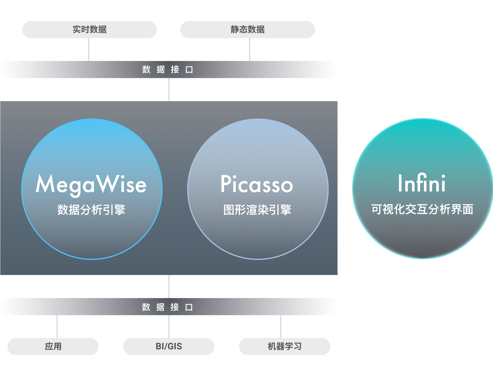

# ZILLIZ Analytics

ZILLIZ Analytics, with full intellectual property, is the next-generation visualized, interactive data analytics platform for massive-scale geospatial and temporal data. ZILLIZ Analytics is the first to use the massively parallel processing power of GPUs to speed up SQL operations. Compared with traditional solutions, ZILLIZ Analytics has higher throughput, higher cost-effectiveness, and lower latency. While significantly reducing the computation cost per unit, MegaWise can return query results for billion-scale datasets in subseconds.

> **ZILLIZ Analytics platform includes the following components:**
> 1. MegaWise data analytics engine
> 2. Picasso graphic rendering engine
> 3. Infini interactive analytics interface

## [ZILLIZ Analytics White Paper](white_paper.md)

To try this product, please contact support@zilliz.com.
